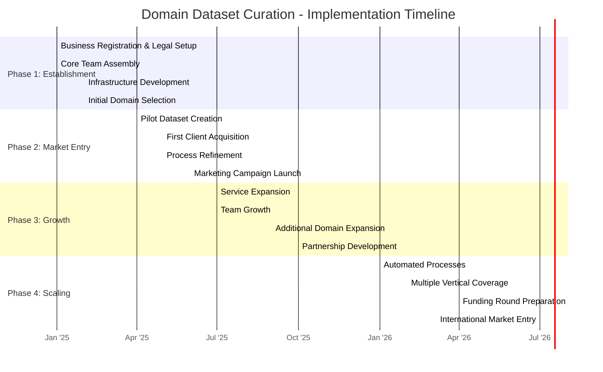

# Domain Dataset Curation
## Business Proposal & Plan

---

## 1. What is Domain Dataset Curation?

Domain Dataset Curation is the specialized process of collecting, organizing, cleaning, and enhancing industry-specific data for AI training and analytics. It focuses on creating high-quality, domain-specific datasets that meet the unique needs of particular industries or applications.

### Key Activities:
- **Targeted Data Collection** - Gathering relevant data from industry sources
- **Data Cleaning & Validation** - Ensuring accuracy and consistency
- **Domain-Specific Labeling** - Applying expert knowledge for proper annotation
- **Metadata Enhancement** - Adding context and relationships
- **Quality Assurance** - Rigorous testing for bias and completeness
- **Compliance Verification** - Ensuring legal and ethical data usage
- **Custom Dataset Packaging** - Creating ready-to-use formats for AI models

---

## 2. Why Enter This Business?

### Key Reasons:
- **High Market Demand** - $2B projected market by 2030 (per document)
- **Low Competition** - Medium competitive landscape with room for new entrants
- **Low Entry Barrier** - $10-50K minimum capital requirements
- **Increasing AI Adoption** - Growing need for specialized training data
- **Domain Knowledge Leverage** - Value creation through industry expertise
- **Scalable Business Model** - Ability to expand across multiple verticals
- **Recurring Revenue Potential** - Ongoing data updates and maintenance

---

## 3. Prerequisites for Entry

### Essential Requirements:
- **Domain Expertise** - Deep knowledge in at least one industry vertical
- **Data Science Skills** - Understanding of data structures and AI requirements
- **Technical Infrastructure** - Data storage, processing, and delivery capabilities
- **Quality Control Processes** - Methods to ensure data accuracy and relevance
- **Legal Knowledge** - Understanding of data privacy and licensing regulations
- **Industry Connections** - Network for data sourcing and customer acquisition
- **Initial Capital** - $10-50K startup funding (equipment, software, staff)

---

## 4. Getting Started: Business Development

### Products & Services:
- **Custom Dataset Creation** - Tailored collections for specific AI applications
- **Data Cleaning & Enhancement** - Improving existing client datasets
- **Continuous Dataset Updates** - Regular refreshes with new information
- **Data Augmentation Services** - Expanding limited datasets through synthesis
- **Dataset Quality Certification** - Validating third-party data collections
- **Domain-Specific Labeling** - Expert annotation services
- **Data Strategy Consulting** - Advising on data acquisition and usage

### Initial Focus Areas:
1. **Healthcare Data** - Medical imaging, clinical notes, pharmaceutical trials
2. **Financial Services** - Transaction patterns, risk indicators, market signals
3. **Manufacturing** - Process optimization, quality control, supply chain

---

## 5. Financial Projections

### Initial Investment:
- Equipment & Infrastructure: $15,000
- Software & Tools: $10,000
- Legal & Compliance: $5,000
- Initial Marketing: $10,000
- Working Capital: $10,000
- **Total Minimum Investment: $50,000**

### Revenue Streams:
- Dataset License Fees
- Custom Dataset Creation Services
- Data Maintenance Subscriptions
- Consulting & Advisory Services
- Data Validation & Certification

### 3-Year Pro Forma Projection:
| Metric | Year 1 | Year 2 | Year 3 |
|--------|--------|--------|--------|
| **Revenue Streams:** |  |  |  |
| Dataset License Fees | $45,000 | $120,000 | $240,000 |
| Custom Dataset Creation | $50,000 | $125,000 | $250,000 |
| Data Maintenance Subscriptions | $15,000 | $65,000 | $150,000 |
| Consulting & Advisory Services | $10,000 | $30,000 | $75,000 |
| Data Validation & Certification | $0 | $10,000 | $35,000 |
| **Total Revenue** | **$120,000** | **$350,000** | **$750,000** |
| **Expenses** | $100,000 | $250,000 | $450,000 |
| **Net Profit** | **$20,000** | **$100,000** | **$300,000** |
| **Profit Margin** | 17% | 29% | 40% |
| **ROI** | 40% | 200% | 600% |

### ROI Analysis:
- Break-even: Month 10
- 1st Year ROI: 40% 
- 3-Year Cumulative ROI: 840%
- Projected Valuation (Year 3): $3-4.5M (5-6x revenue)

---

## 6. Risk Assessment & Mitigation

| Risk | Impact | Probability | Mitigation Strategy |
|------|--------|------------|---------------------|
| Data Privacy Regulations | High | High | Robust compliance framework, regular legal audits |
| Quality Control Issues | High | Medium | Automated + human verification, clear QA processes |
| Client Dependency | Medium | Medium | Diversify client base across industries |
| Technology Changes | Medium | Medium | Continuous skill development, flexible architecture |
| Pricing Pressure | Medium | High | Focus on specialized niches with high-value datasets |
| Talent Acquisition | High | Medium | Partner with universities, offer equity, remote work |
| Data Source Limitations | High | Medium | Develop multiple sourcing channels, synthetic data capabilities |

---

## 7. Implementation Timeline

### Key Milestones:

#### Phase 1: Establishment (Months 1-3)
- **Month 1**: Complete business registration and legal setup
- **Month 2**: Acquire core infrastructure and select initial domain focus
- **Month 3**: Finalize core team and initial operational capabilities

#### Phase 2: Market Entry (Months 4-6)
- **Month 4**: Complete first pilot dataset ready for demonstration
- **Month 5**: Acquire first paying client
- **Month 6**: Launch formal marketing campaign with proven case study

#### Phase 3: Growth (Months 7-12)
- **Month 9**: Expand service offerings based on client feedback
- **Month 10**: Reach operational break-even
- **Month 12**: Establish partnerships with at least two AI solution providers

#### Phase 4: Scaling (Year 2)
- **Month 15**: Implement automated data processing pipelines
- **Month 18**: Expand to at least three industry verticals
- **Month 21**: Complete Series A funding (if needed for expansion)
- **Month 24**: Enter first international market

---

## 8. Competitive Advantage

- **Domain Specificity** - Deeper industry knowledge than generalist competitors
- **Quality Over Quantity** - Focus on high-value, high-accuracy datasets
- **Transparent Methodology** - Clear documentation of data sources and processes
- **Customization Capability** - Tailored solutions for specific client needs
- **Compliance Expertise** - Built-in regulatory adherence
- **Agile Approach** - Ability to quickly adapt to changing requirements
- **End-to-End Services** - From strategy to implementation

---

## 9. Conclusion & Next Steps

Domain Dataset Curation presents a compelling business opportunity with relatively low barriers to entry and strong growth potential. The increasing adoption of AI across industries creates sustainable demand for high-quality, specialized datasets.

### Immediate Next Steps:
1. Finalize domain focus based on team expertise
2. Develop detailed technical infrastructure plan
3. Create legal framework for data acquisition
4. Identify and approach potential pilot clients
5. Secure initial funding
